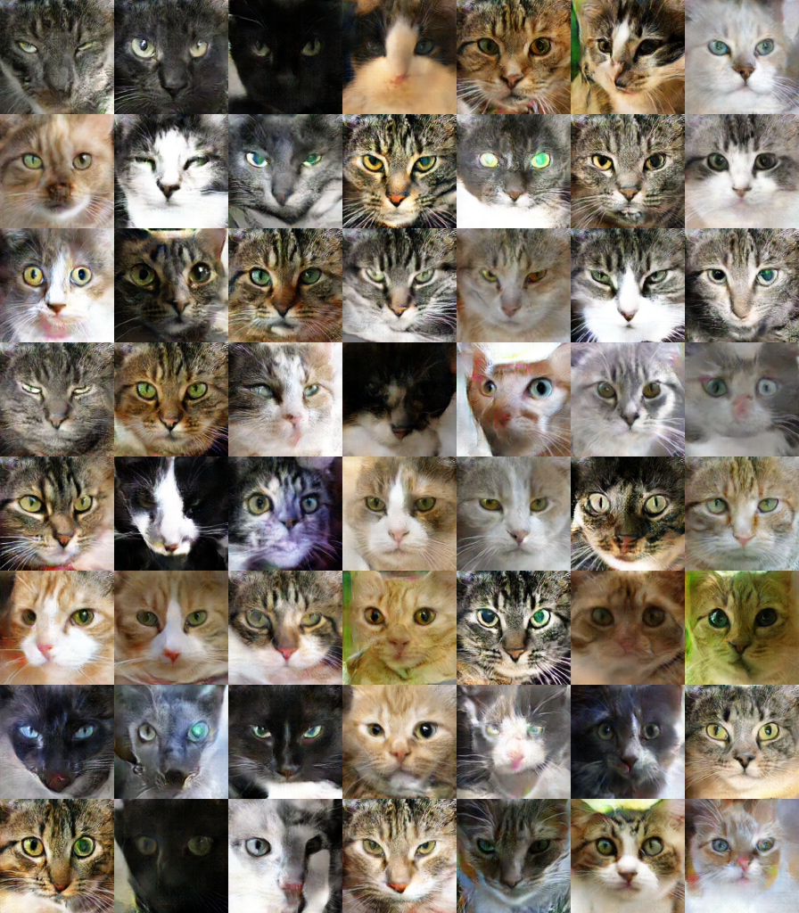

# improved_LSGAN




Code for [On the Effectiveness of Least Squares Generative Adversarial Networks](https://arxiv.org/abs/1712.06391) and [Least Squares Generative Adversarial Networks](http://openaccess.thecvf.com/content_iccv_2017/html/Mao_Least_Squares_Generative_ICCV_2017_paper.html)

Related project: [LSGAN](https://github.com/xudonmao/LSGAN)

### Prerequisites
- Tensorflow
- SciPy


### Cats
The code of pre-process methods is from [this project](https://github.com/AlexiaJM/Deep-learning-with-cats).

1. Prepare data
```
cd cats
sh convert_data.sh
```
2. Training
```
python main.py --loss lsgan
python main.py --loss dcgan
```

3. Sampling from saved models

   Download saved models from [here](https://github.com/xudonmao/saved_models_improved_LSGAN).

```
cat saved_models.tar.gz.* | tar xzvf -
python sampling --checkpoint_dir ./saved_models/lsgan/
python sampling --checkpoint_dir ./saved_models/dcgan/
```

### Datasets with small variance
0. If using the dataset only
```
cd small_variance_datasets
tar xzvf data.tar.gz
#Then find the dataset in ./data/
```

1. Prepare data
```
cd small_variance_datasets
sh convert_data.sh
```

2. Training
```
python main --loss lsgan
python main --loss dcgan
```

### Difficult architectures
The code of this experiment is based on [this project](https://github.com/igul222/improved_wgan_training).

1. Prepare data

    Download [LSUN-bedroom](http://lsun.cs.princeton.edu/2016/)

```
cd difficult_architectures/resnet
sh convert_data.sh $DATA_DIR
```

2. Training
```
python gan_64x64.py
```


### Citation
If you use this work in your research, please cite:

    @article{arxiv1712.06391,
      author = {Xudong Mao and Qing Li and Haoran Xie and Raymond Y.K. Lau and Zhen Wang and Stephen Paul Smolley},
      title = {On the Effectiveness of Least Squares Generative Adversarial Networks},
      journal = {arXiv preprint arXiv:1712.06391},
      year = {2017}
    }
    @inproceedings{Mao2017,
      author = {Xudong Mao and Qing Li and Haoran Xie and Raymond Y.K. Lau and Zhen Wang and Stephen Paul Smolley},
      title = {Least Squares Generative Adversarial Networks},
      booktitle = {International Conference on Computer Vision (ICCV)},
      year = 2017
    }
    
 
